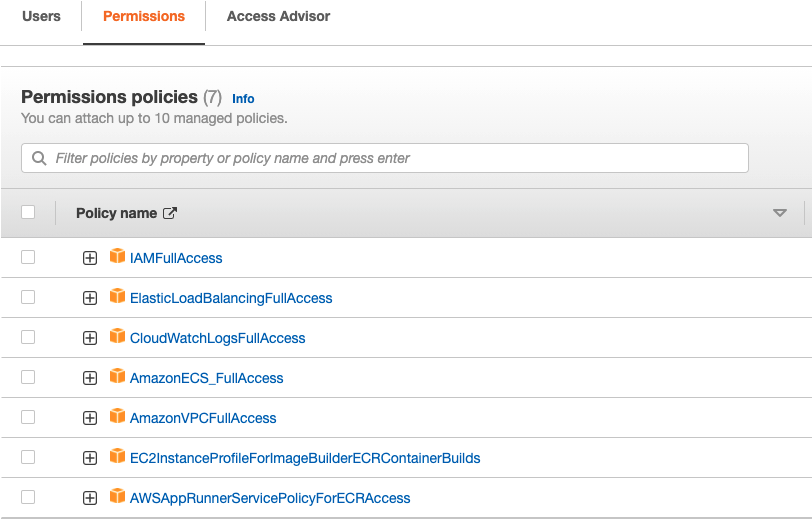
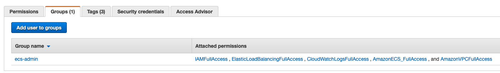
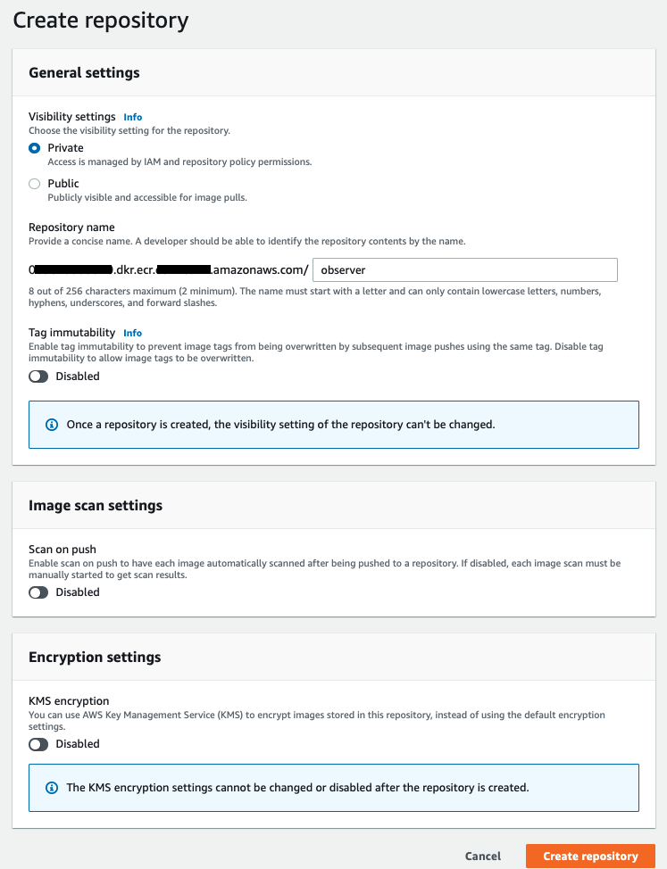

# Resource Utilization Watch Application [Observer]

This project developed using the Python Flask for the backend and React.Js for the front-end sides.

## 1. Docker Compose

Run the applications as a container on the local Docker environment using docker-compose.

[Go to Docker-Compose example](iac/docker-compose#section)

## 2. AWS Fargate - ECS

Run the applications as a container on the AWS Fargate serverless infrastructure using the Elastic Container Service and Elastic Container Registry.

### 2.1. Create IAM requirements

Create a new IAM [User Group] named "ecs-admin" with the following **Permission Policies** to manage ECS Fargate Cluster;



Create a new IAM [User] and add it to the newly created as "ecs-admin" [User Group] above to manage the ECS Fargate Cluster.

Get the Access and Secret Keys generated for this user to access AWS using Terraform and manage the ECS Cluster.


<br/>

### 2.2. Create ECR Private Registry

Create a new Elastic Container Registry(ECR) Private Repository to store application Images


<br/>


Login to **ECR Private Repository** in the local Docker using the **aws-cli**;
```local
aws ecr get-login-password --region <region> | docker login --username AWS --password-stdin <account_id>.dkr.ecr.<region>.amazonaws.com
```

Set the ECR Repository address as a ENV value;
```local
export ECR_REPO="<account_id>.dkr.ecr.<region>.amazonaws.com/<repo_name>"
```
<br/>

Build and Push the Image to ECR Private Repository for Python Restapi application;
```local
cd api

docker build -t $ECR_REPO:api-0.0.1 .

docker push $ECR_REPO:api-0.0.1

cd ..
```
<br/>

Build and Push the Image to ECR Private Repository for React front-end application;
```local
cd sys-stats

docker build -t $ECR_REPO:client-0.0.1 .

docker push $ECR_REPO:client-0.0.1

cd ..
```
<br/>

Build and Push the Image to ECR Private Repository for Nginx proxy server;
```local
cd nginx

docker build --build-arg NGINX_CONF=aws-ecs -t $ECR_REPO:nginx-0.0.1 .

docker push $ECR_REPO:nginx-0.0.1

cd ..
```

### 2.3. Create ECS Cluster and Other Resources on the AWS using Terraform

After the creation IAM requirements(Step 1) and ECR Private Repository(Step 2) go to the "iac/terraform-ecs" directory to create Elastic Container Service Cluster and other Services, Components using Terraform;

[Go to AWS Fargate - ECS example using Terraform](iac/terraform-ecs#section)

<br/>

## 3. Kubernetes Deployment

Deploy the applications as a container and using Nginx Ingress Controller to Kubernetes.

[Go to K8s Deployment example](iac/k8s#section)
